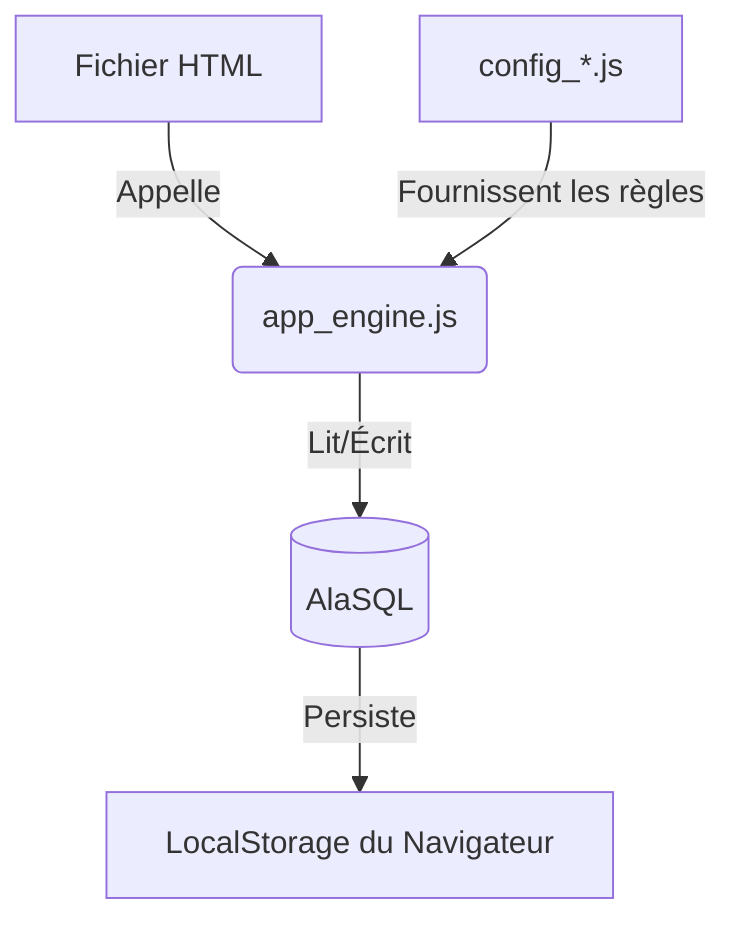
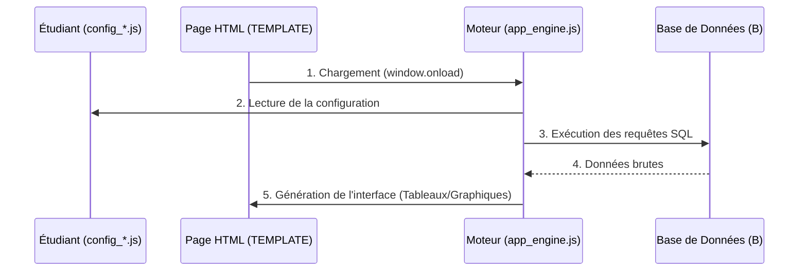

# 📚 SQL Academy - MiniCRUD Pédagogique

Bienvenue dans **SQL Academy**, une application web légère et interactive conçue pour apprendre le langage SQL par la pratique, sans avoir besoin d'installer de serveur de base de données complexe.

## 🎯 But du projet
L'objectif est de permettre à un étudiant de comprendre comment les données sont stockées, reliées et affichées dans une application moderne. En modifiant simplement un fichier de configuration, l'étudiant construit petit à petit son propre outil de gestion de bibliothèque.

---

## 🚀 Guide pour les Non-Techniciens

### Comment ça marche ?
Le site fonctionne directement dans votre navigateur. Vous n'avez rien à installer. 

- **La Base de Données** : Elle vit dans votre navigateur (via *AlaSQL*). Si vous rafraîchissez la page, vos changements sont conservés si vous avez activé le "Mode Persistant".
- **Le Grimoire (config_*.js)** : C'est le seul endroit que vous aurez vraiment besoin de modifier. C'est ici que vous définissez vos menus, vos formulaires et vos graphiques.
  - **Bonne pratique** : Centralisez vos requêtes dans `config_queries.js` pour les réutiliser facilement dans `config_pages.js`.

### Comment l'utiliser ?
1. **Explorez** : Utilisez le menu de gauche pour naviguer dans l'application pré-configurée.
2. **Relevez les Missions** : Sur la page d'accueil, suivez les instructions des onglets "Mission".
3. **Personnalisez** : 
   - Dupliquez un fichier `TEMPLATE_*.html` (par exemple `TEMPLATE_list.html`).
   - Renommez-le (ex: `mes_livres.html`).
   - Dans les fichiers `config_*.js`, ajoutez la configuration correspondante à votre nouvelle page.
4. **Réinitialisez** : En cas d'erreur bloquante, cliquez sur l'icône ⚙️ (Paramètres) en bas à gauche et utilisez le bouton **Réinitialiser la Base**.

---

## 🛠️ Structure du Projet

- `index.html` : La porte d'entrée avec le guide des missions.
- `config_app.js`, `config_queries.js`, `config_pages.js` : **Les fichiers de configuration**. Ils remplacent l'ancien `config.js` pour une meilleure organisation.
- `config.js.template` : Une version quasi vide de configuration pour démarrer un nouveau projet de zéro.
- `init_db.js` : Le script SQL qui crée les tables et les données au tout premier démarrage.
- `app_engine.js` : Le "moteur" (JavaScript) qui transforme vos configurations en interface visuelle. **(Ne pas modifier)**.
- `style.css` : L'habillage visuel de l'application.
- `TEMPLATE_*.html` : Des fichiers modèles à copier pour créer de nouvelles fonctionnalités (listes, formulaires, stats).

- **`page_details` (dans `config_app.js`)** : Définit le fichier HTML utilisé par défaut pour tous les formulaires. Très pratique au début pour tout centraliser sur `TEMPLATE_form.html`.
- **`form_page_url` (dans `config_pages.js`)** : Permet de choisir un fichier HTML spécifique pour le formulaire d'une page précise (ex: `membres_form.html`). Cela surcharge le réglage général.

---

## 👨‍💻 Espace Technicien (Avancé)

### Architecture
Le projet repose sur une architecture **"No-Backend"** :

- **Base de données** : [AlaSQL](https://github.com/AlaSQL/alasql), une base de données SQL en mémoire/localStorage.
- **UI Framework** : [Pico CSS](https://picocss.com/), un framework CSS minimaliste utilisant des variables sémantiques.
- **Graphiques** : [Chart.js](https://www.chartjs.org/) pour le rendu des statistiques.

### Extension du moteur
Le fichier `app_engine.js` gère dynamiquement :
- L'injection de la barre latérale et du pied de page SQL.
- Le rendu des tableaux avec détection automatique des colonnes.
- La génération de formulaires à partir d'objets JSON.
- Le "Pretty Print" automatique pour les colonnes contenant des objets JSON.

---

## 🎓 Guide Pédagogique

Ce projet est idéal pour des cours d'initiation aux systèmes d'information ou au développement web.

### Objectifs d'apprentissage
1. **Syntaxe SQL de base** : `SELECT`, `FROM`, `WHERE`, `ORDER BY`.
2. **Agrégation** : Comprendre le `GROUP BY` et les fonctions comme `COUNT()`.
3. **Jointures** : Relier des tables (ex: `emprunts` avec `livres`).
4. **Structure de données** : Comprendre la relation entre un champ de formulaire et une colonne de table.

### Exemples d'exercices (TP)
- **Niveau 1** : Ajouter un champ "Genre" (BD, Policier, Roman) dans le formulaire des livres.
- **Niveau 2** : Créer une page de statistiques affichant le nombre de membres par domaine d'email.
- **Niveau 3** : Modifier la requête SQL de la liste des livres pour n'afficher que ceux publiés après 1950.
- **Niveau Expert** : Implémenter une gestion de "Retour de livre" en ajoutant une colonne `est_rendu` et en filtrant l'affichage.

---
*Développé pour l'apprentissage du SQL simplifié.*
